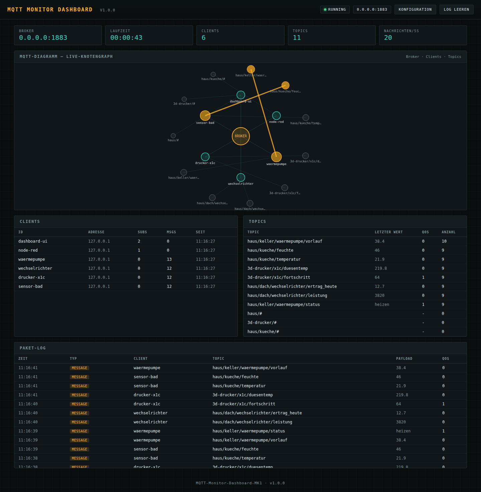

# MQTT-Monitor-Dashboard-MK1



Einzeldatei-Flask-Anwendung nach dem Design-Vorbild von "BambuLab-MQTT-Dashboard-MK6".
Stellt einen eingebetteten MQTT-Broker im lokalen Netzwerk bereit und stellt alle
eintreffenden Pakete/Topics live als Knotengraph ("MQTT-Diagramm") dar: Broker in
der Mitte, Clients und Topics als Knoten drumherum, Verbindungslinien pulsieren
bei jedem Paket. Darunter Client-/Topic-Tabellen sowie ein chronologisches
Paket-Log.

Aktuelle Version: **v1.0.0**

## Lokaler Start

```
pip install -r requirements.txt
python app.py
```

Web-UI danach unter `http://<Rechner-IP>:8090` erreichbar (Port konfigurierbar,
siehe unten). Der MQTT-Broker lauscht standardmaessig auf `0.0.0.0:1883`.

## Konfiguration (`config.json`)

Liegt neben `app.py` (bzw. neben der EXE/App) und wird nicht ueberschrieben:

| Feld | Bedeutung |
|---|---|
| `mqtt_host` / `mqtt_port` | Bind-Adresse des MQTT-Brokers |
| `web_host` / `web_port` | Bind-Adresse der Web-Oberflaeche |
| `allow_anonymous` | `true` = jeder darf sich verbinden |
| `username` / `password` | Zugangsdaten, falls `allow_anonymous: false` |
| `max_log_entries` | Groesse des serverseitigen Paket-Logs |
| `client_timeout_seconds` | Nach dieser Inaktivitaet gilt ein Client als getrennt |

Aenderungen ueber das Konfigurationspanel in der Web-UI werden direkt in
`config.json` gespeichert; Aenderungen an Bind-Adresse/Port/Zugangsdaten starten
den Broker automatisch neu (bestehende Verbindungen werden dabei getrennt).

## Key files

- `app.py` — Einzeldatei-Flask-App mit eingebettetem HTML/CSS/JS und eingebettetem
  MQTT-Broker (Bibliothek `amqtt`, asyncio-basiert, eigener Thread + eigener
  Event-Loop, ueber ein Plugin an den gemeinsamen Anwendungszustand angebunden)
- `config.json` — Laufzeitkonfiguration (siehe oben)
- `.github/workflows/build-exe.yml` — GitHub-Actions-Workflow: baut bei **jedem
  Push** (auf jeden Branch, oder manuell per "Run workflow") eine Windows-EXE
  und eine macOS-App (PyInstaller) als Build-Artefakte; bei einem zusaetzlichen
  `v*`-Tag werden beide zudem als ZIP an ein GitHub-Release angehaengt

## Architektur

- Runtime: Python/Flask, `amqtt` (eingebetteter MQTT-Broker), PyInstaller fuer
  EXE/App-Builds, GitHub Actions CI
- Der Broker laeuft in einem eigenen Thread mit eigenem asyncio-Event-Loop,
  parallel zum Flask-Entwicklungsserver (`threaded=True`) im Hauptthread
- Alle Broker-Ereignisse (Connect/Disconnect/Subscribe/Unsubscribe/Message)
  werden ueber ein `amqtt`-Plugin (`MonitorPlugin`) in einen thread-sicheren
  `AppState` gespiegelt; die Web-UI pollt `/api/state` alle 700 ms
- Das Knotengraph-Rendering laeuft clientseitig auf einem `<canvas>`-Element
  ohne externe JS-Bibliotheken (Offline-faehig, wichtig fuer die gepackte
  EXE/App ohne Internetzugriff)

## Bekannte Vereinfachungen (v1.0.0)

- Abonnements werden als literale Topic-Filter dargestellt (z. B. `home/#`
  erscheint als eigener Knoten); eine Aufloesung von Wildcards gegen einzelne
  Topics findet in der Graph-Darstellung nicht statt
- `$SYS`-Systemtopics des Brokers werden bewusst nicht aktiviert, um das
  Diagramm nicht mit internem Traffic zu ueberladen
